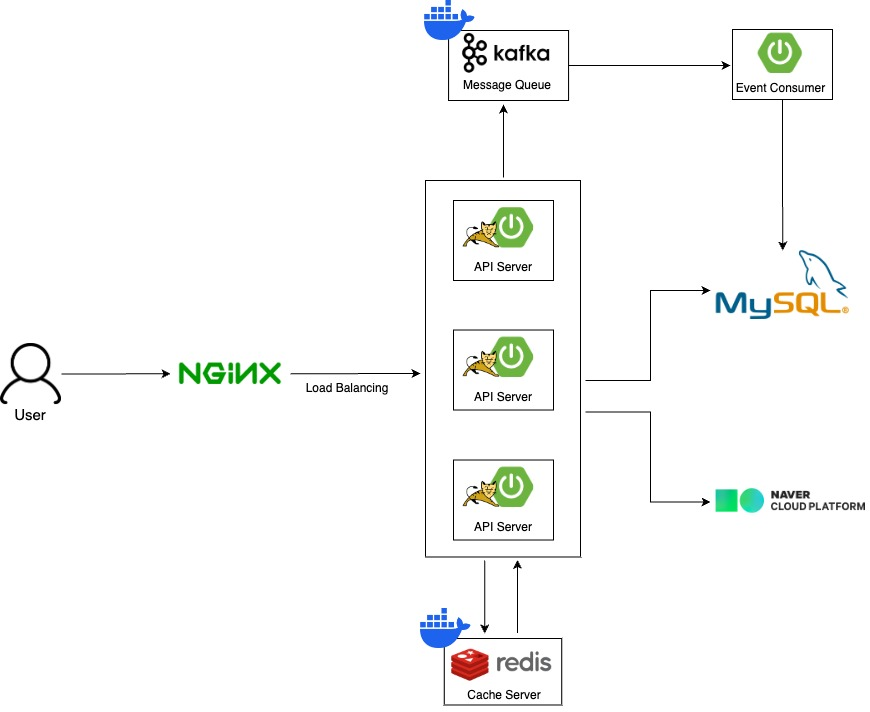
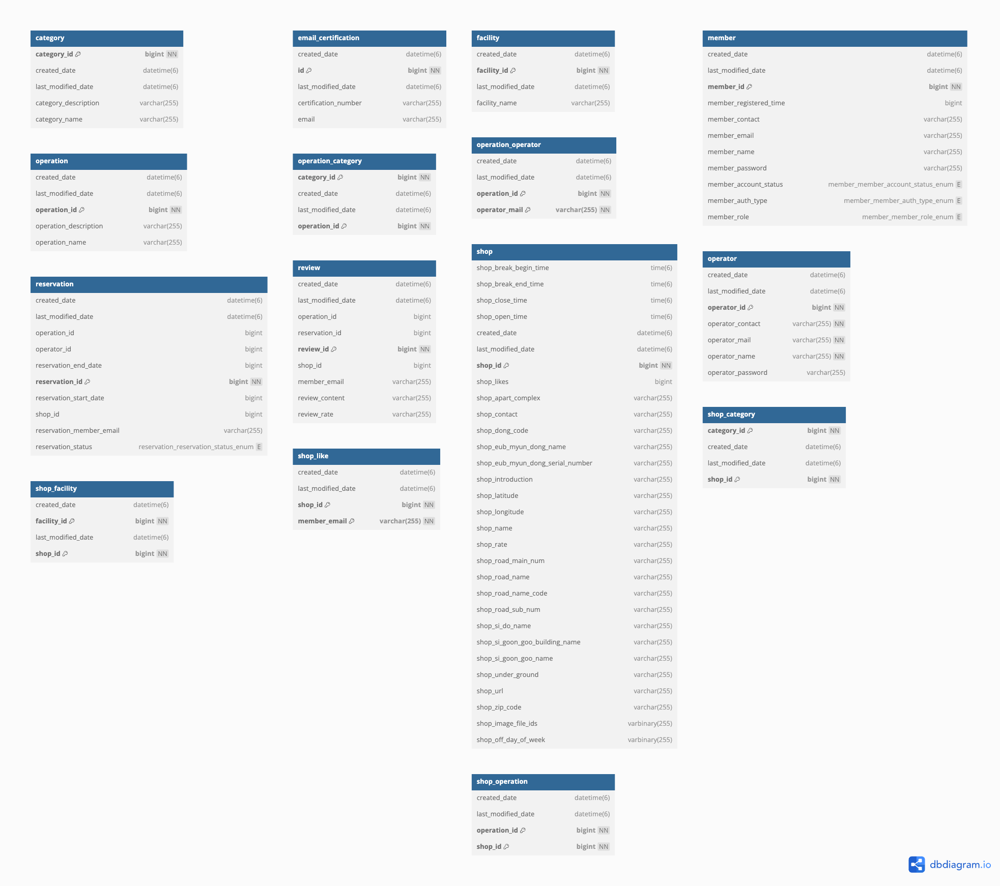

# beautify-project
- 두피 문신, 타투, 눈썹 문신 등 영세 미용 시술소 예약 플랫폼

## 프로젝트 목표

- 실무에서 활용해보지 못했던 기술들(kafka, redis, jpa, spring security, jenkins, docker)을 깊이있게 학습하고 적용
- JPA를 활용한 애플리케이션 중심의 비즈니스 로직 개발 방식 적용
- 명확한 목적을 가지고 있는 테스트 코드 작성

## 시스템 아키텍처

## DB

## 고민 상황 및 해결 방안

1. 모듈 분리
   - https://velog.io/@sssukho/Spring-Boot-%EB%A9%80%ED%8B%B0-%EB%AA%A8%EB%93%88-%EA%B5%AC%EC%A1%B0-%EC%A0%81%EC%9A%A9-%ED%9B%84%EA%B8%B0
2. SQL 중심의 비즈니스 로직 vs JPA를 활용한 애플리케이션 중심의 비즈니스 로직
   - 작성중..
3. 좋아요 동시성 이슈
   - 작성중..
4. kafka 메세지 직렬화 
   - 작성중..

