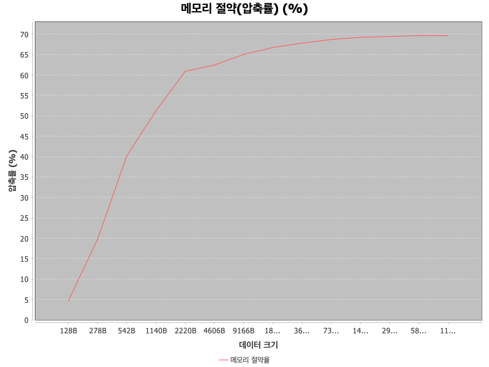
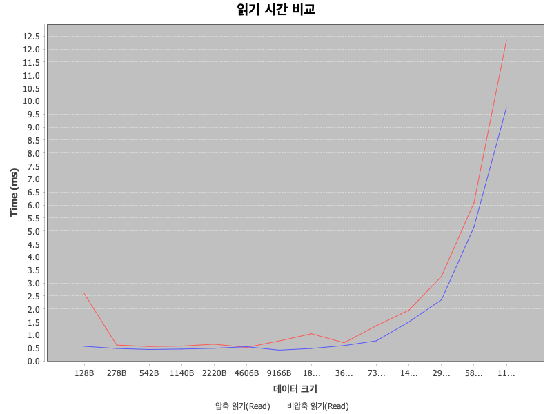
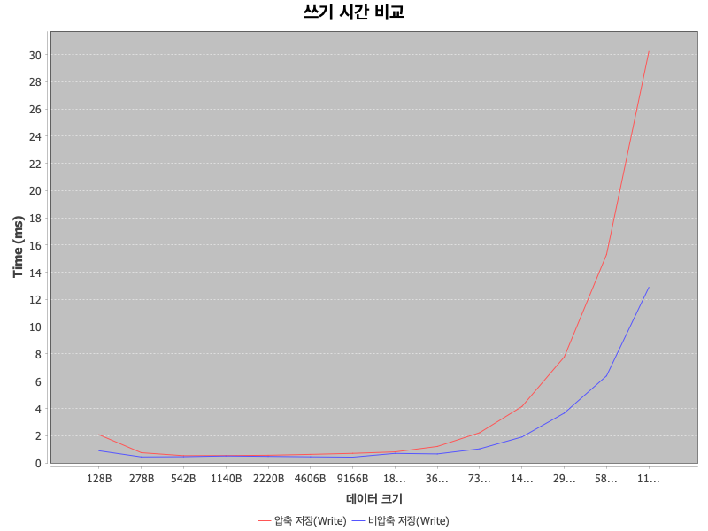

# spring boot cache 확장 라이브러리

Redis에 저장되는 캐시 값 중 일정 크기 이상인 경우 GZIP 압축을 적용하여 저장하는 spring boot 확장 라이브러리 입니다.


</br>

## 레파지토리 내 모듈 구성

- `cache-extension`: GZIP 압축 기능을 포함한 Redis Cache 자동 설정 라이브러리
- `api`: 라이브러리를 사용하는 샘플 애플리케이션 (API 서버 역할)


</br>

## 주요 기능

1. Spring Boot Auto Configuration 기반 자동 설정
2. 설정 임계값 이상의 데이터 캐싱시 GZIP 압축
3. Spring Cache 확장 모듈로, `@Cacheable` 과 호환
4. JUnit + Testcontainers 기반의 단위/통합 테스트 포함


</br>

## cache-extension 사용 방법

### private github package 를 repository 로 추가

``` groovy
repositories {
		mavenCentral()
		maven {
			url = uri("https://maven.pkg.github.com/f-lab-edu/beautify-project")
			credentials {
				username = "username" // beautify-project 레포지토리에 접근 권한 있는 계정
				token = "token" // beautify-project 레포지토리에 접근 권한 토큰
			}
		}
	}
```


### import

``` groovy
// https://maven.pkg.github.com/sssukho/f-lab-edu/beautify-project
implementation 'com.bp:bp-cache-extension:0.0.1-SNAPSHOT'
```


### 설정 파일(`application.yml`)

``` yaml
cache:
  redis:
    enabled: true
    host: localhost
    port: 6379
    password: 12341234
    timeout: 5s
    configs-by-name:
      default:
        compression-threshold-bytes: 1024
        ttl: 60s
      big-data:
        compression-threshold-bytes: 1024
        ttl: 120s
      small-data:
        compression-threshold-bytes: 512
        ttl: 60s

```

- `cache.redis.enabled`: 값이 false 이거나 key 값이 존재하지 않는다면, redis와의 연결 설정 및 spring cache 설정을 진행하지 않습니다.
- `cache.redis.host`: redis 인스턴스 host
- `cache.redis.port`: redis 인스턴스 port
- `cache.redis.password`: redis 인스턴스 password
- `cache.redis.configs-by-name`: 캐시 이름별 압축 threshold(byte 단위), ttl 설정

적정 compression-threshold-bytes 값은 본 문서의 [테스트 결과](#테스트-결과)를 참고하여 설정하시기 바랍니다.


### @Cacheable

```java
@Cacheable(value = "big-data", key = "#root.args[0]")
public String bigData(final String key) {
  // 구현부
}
```

- `@Cacheable` 은 메소드 호출 결과를 캐시에 저장하여 다음 호출 시 캐시된 값을 반환하는 데 사용되는 spring-cache 에서 제공하는 어노테이션 입니다.
- 이러한 `@Cacheable` 사용 방식을 그대로 유지하면서 저장되는 데이터의 크기에 따라 자동으로 GZIP 압축을 적용합니다.
- **주의할 점으로는 설정 파일에 지정한 캐시 이름(`cache.redis.configs-by-name.XXX`)과 `@Cacheable` 의 value에 지정한 이름과 일치해야 해당 캐시별로 threshold와 TTL이 적용됩니다. 이외에는 기본값 (compression-threshold-bytes=1024 bytes, ttl: 30m)이 적용됩니다.**


</br>

## 압축 알고리즘

- 압축 알고리즘: `GZIP` (java.util.zip.GZIPOutputStream / java.util.zip.GZIPInputStream)
- GZIP 선정 이유
    1. CPU 부하 대비 적당히 높은 압축률 제공
    2. 운영 환경의 검증된 안정성
        - HTTP 응답 압축, Kafka 메세지 압축 등 이미 타 시스템에서 쓰고 있는 검증된 압축 알고리즘 입니다.
    3. 단순성
        - 별도 의존성 추가 필요 없이 Java 표준 라이브러리를 사용하여 개발할 수 있음


</br>

## 개발 환경

- Java 21
- spring-boot-starter-cache:3.3.2
- spring-boot-starter-data-redis:3.3.2
- Gradle 8.x
- Testcontainers (Redis 7)


</br>

## 테스트

**통합 테스트는 `testcontainers` 기반으로 Redis 컨테이너를 실행하며, 로컬에서 별도 Redis 인스턴스가 없이 동작은 하지만 <u>docker engine은 동작중이어야 합니다.</u>**

루트 디렉토리에서 다음 명령어로 테스트를 실행할 수 있습니다.

``` bash
./gradlew test
```

또는 다음과 같이 모듈별로 테스트를 실행할 수 있습니다.

``` bash
./gradlew :cache-extension:test
./gradlew :api:test
```


### 테스트 데이터

``` json
{
  "shopName": "MNesNXOBrDG",
  "userId": "lHyLGMGS",
  "reservationId": 72299,
  "reservationStartTime": "2025-07-26 01:00",
  "reservationEndTime": "2025-07-26 03:00",
  "itemId": 93953,
  "description": "자Y처커pnYNn거kG카어x나"
}
```

토스 플레이스의 업종별 기능 소개 페이지(https://tossplace.com/sector/beauty)에서 도메인을 일부 유추하여 위와 같은 JSON 스키마를 기준으로 값들만 random 으로 생성하여 테스트를 진행했습니다.


### 테스트 결과

> 테스트 결과는 Testcontainer(Redis 7)을 통해 진행한 결과입니다.

```
================================
데이터 크기: 128 bytes (0.13 KB)
압축된 데이터 크기: 115 bytes (0.11 KB)
메모리 절약(압축률): 10.16%

압축 저장 시간: 2.040 ms
압축 조회 시간: 2.031 ms
비압축 저장 시간: 0.660 ms
비압축 조회 시간: 0.628 ms

================================
데이터 크기: 272 bytes (0.27 KB)
압축된 데이터 크기: 207 bytes (0.20 KB)
메모리 절약(압축률): 23.90%

압축 저장 시간: 0.739 ms
압축 조회 시간: 0.703 ms
비압축 저장 시간: 0.538 ms
비압축 조회 시간: 0.480 ms

================================
데이터 크기: 606 bytes (0.59 KB)
압축된 데이터 크기: 375 bytes (0.37 KB)
메모리 절약(압축률): 38.12%

압축 저장 시간: 0.508 ms
압축 조회 시간: 0.532 ms
비압축 저장 시간: 0.418 ms
비압축 조회 시간: 0.401 ms

================================
데이터 크기: 1122 bytes (1.10 KB)
압축된 데이터 크기: 539 bytes (0.53 KB)
메모리 절약(압축률): 51.96%

압축 저장 시간: 0.538 ms
압축 조회 시간: 0.561 ms
비압축 저장 시간: 0.442 ms
비압축 조회 시간: 0.398 ms

================================
데이터 크기: 2308 bytes (2.25 KB)
압축된 데이터 크기: 969 bytes (0.95 KB)
메모리 절약(압축률): 58.02%

압축 저장 시간: 0.574 ms
압축 조회 시간: 0.631 ms
비압축 저장 시간: 0.461 ms
비압축 조회 시간: 0.416 ms

================================
데이터 크기: 4566 bytes (4.46 KB)
압축된 데이터 크기: 1709 bytes (1.67 KB)
메모리 절약(압축률): 62.57%

압축 저장 시간: 0.830 ms
압축 조회 시간: 0.514 ms
비압축 저장 시간: 0.484 ms
비압축 조회 시간: 0.480 ms

================================
데이터 크기: 9194 bytes (8.98 KB)
압축된 데이터 크기: 3244 bytes (3.17 KB)
메모리 절약(압축률): 64.72%

압축 저장 시간: 0.696 ms
압축 조회 시간: 0.669 ms
비압축 저장 시간: 0.433 ms
비압축 조회 시간: 0.442 ms

================================
데이터 크기: 18376 bytes (17.95 KB)
압축된 데이터 크기: 6115 bytes (5.97 KB)
메모리 절약(압축률): 66.72%

압축 저장 시간: 0.825 ms
압축 조회 시간: 0.615 ms
비압축 저장 시간: 0.536 ms
비압축 조회 시간: 0.548 ms

================================
데이터 크기: 36554 bytes (35.70 KB)
압축된 데이터 크기: 11636 bytes (11.36 KB)
메모리 절약(압축률): 68.17%

압축 저장 시간: 1.279 ms
압축 조회 시간: 1.180 ms
비압축 저장 시간: 0.637 ms
비압축 조회 시간: 0.527 ms

================================
데이터 크기: 73450 bytes (71.73 KB)
압축된 데이터 크기: 22956 bytes (22.42 KB)
메모리 절약(압축률): 68.75%

압축 저장 시간: 2.121 ms
압축 조회 시간: 1.119 ms
비압축 저장 시간: 1.310 ms
비압축 조회 시간: 1.102 ms

================================
데이터 크기: 146412 bytes (142.98 KB)
압축된 데이터 크기: 44894 bytes (43.84 KB)
메모리 절약(압축률): 69.34%

압축 저장 시간: 4.054 ms
압축 조회 시간: 1.897 ms
비압축 저장 시간: 2.895 ms
비압축 조회 시간: 1.703 ms

================================
데이터 크기: 293648 bytes (286.77 KB)
압축된 데이터 크기: 89651 bytes (87.55 KB)
메모리 절약(압축률): 69.47%

압축 저장 시간: 8.183 ms
압축 조회 시간: 3.568 ms
비압축 저장 시간: 2.814 ms
비압축 조회 시간: 2.459 ms

================================
데이터 크기: 588064 bytes (574.28 KB)
압축된 데이터 크기: 178928 bytes (174.73 KB)
메모리 절약(압축률): 69.57%

압축 저장 시간: 15.914 ms
압축 조회 시간: 6.861 ms
비압축 저장 시간: 5.050 ms
비압축 조회 시간: 5.137 ms

================================
데이터 크기: 1174416 bytes (1146.89 KB)
압축된 데이터 크기: 355961 bytes (347.62 KB)
메모리 절약(압축률): 69.69%

압축 저장 시간: 30.605 ms
압축 조회 시간: 12.873 ms
비압축 저장 시간: 15.199 ms
비압축 조회 시간: 9.475 ms
```







- `메모리 절약(압축률)` = (1 - (압축 후 데이터 크기/압축 전 데이터 크기)) * 100

- 128 bytes ~ 1 MB(1048576 bytes, 1024 KB) 크기의 데이터를 압축 진행

- 해당 테스트를 직접 실행하려면 다음 명령어를 사용하시면 됩니다.

  ```bash
  ./gradlew :cache-extension:test --tests "org.tossplace.extension.cache.IntegrationPerformanceTest" -PrunIntegrationTest
  ```


</br>

## 추가 개선 필요 내용

1. 다양한 압축 알고리즘을 적용할 수 있는 옵션이 필요합니다.
    - 설정 파일 기반으로 다양한 압축 알고리즘을 적용할 수 있도록 개선이 필요합니다.
2. 캐시 이름별로 ttl과 threshold 값을 세부적으로 개선해 나가기 위해 실제 운영 환경에서 redis 관련 metric을 확인하는 모니터링 툴 연동이 필요합니다.

